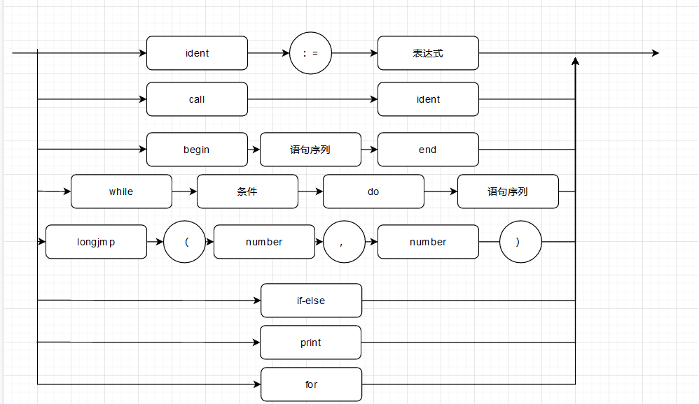
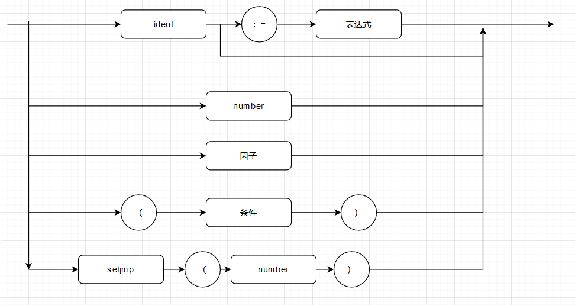
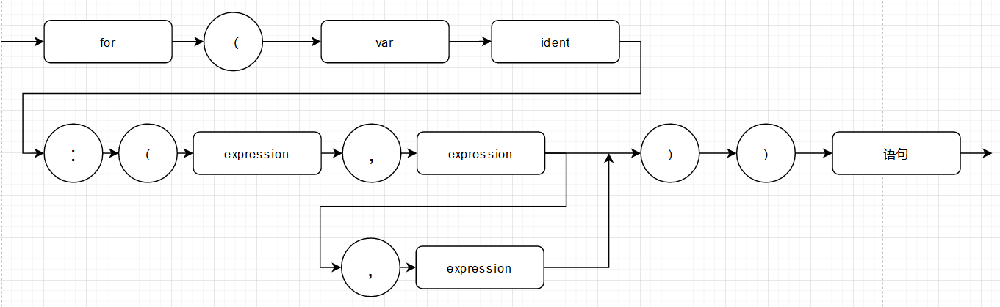
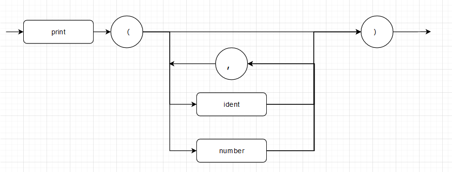
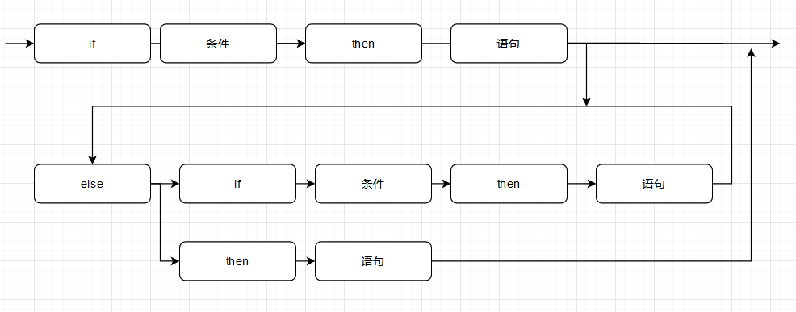
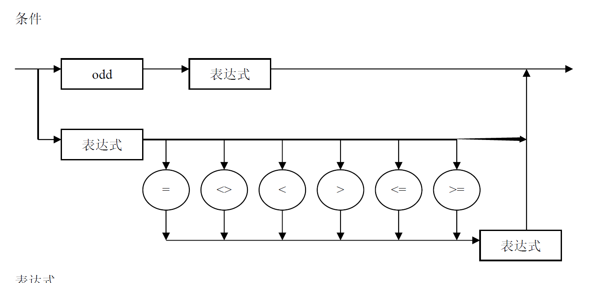

# PL$0$设计文档

---

作者:黄鑫

## 1.setjmp/longjmp

### 作用:

```c
setjmp(buf_id)//记录当前环境，并返回0，
longjmp(buf_id, val)//跳转回setjmp(buf_id)处，并使setjmp返回值val
```

### 分析:

首先,setjmp的“记录环境”并不是记录整个堆栈，而是记录当前的程序计数器(pc)以及当前堆栈指针信息，使得这些信息在调用longjmp恢复时，程序恰好可以正常继续运行.所以longjmp只能在与setjmp同层次或更高层次的过程调用中被调用，否则堆栈已经被销毁,longjmp到原处无法正常运行.

如下图

longjmp调用限定在statement中,(注意图中longjmp和setjmp解析的number应该为const，即可以是一个数字或标识符)



而setjmp因为具有返回值故可以作为factor



### 核心思想

首先增加两条PL0指令,将栈顶(top)以及栈的基地址(base_reg)存入指定位置或从指定位置读取

```c
STP level addr
LTP level addr
```

setjmp可解析为以下PL0指令:

```c
STP 0 buf_addr  //将当前的环境信息存入指定的buf_id对应的地址
LOD 0 data_addr //从当前buf_id指定的地址读取返回值(第一次为0)
```

longjmp可解析为以下PL0指令:

```c
LTP level_diff buf_addr  //读取指定的buf_id对应的地址的环境信息
STO level_diff data_addr //将longjmp指定的返回值存入buf_id的返回值地址
JMP 0 target_pc //PC跳转到buf_id对应的setjmp处
```

每个level为当前level的所有setjmp额外开辟数据空间,用来存储setjmp调用时有效堆栈的栈顶(top)，有效堆栈的栈基地址(base_reg),以及返回值.

由于要使setjmp和longjmp一一对应,则必须要解析完所有代码,得到所有setjmp和longjmp信息才可知.在解析过程中先记录下所有setjmp和longjmp的信息，并先产生代码，在最后再将所有setjmp和longjmp一一对应，并回填相关指令的操作数

```c
typedef struct setjmp_point{
    int jmp_buf_id;//setjmp指定的buf_id
    int level;//层次数
    int stack_top_address;//栈顶信息所在地址
    int return_val_address;//返回值的地址
    int jmp_entry_pc; //该setjmp点对应的pc
}setjmp_point;

typedef struct longjmp_point{
    int jmp_buf_id;//longjmp指定的buf_id
    int return_value;//返回值
    int load_stack_top_pc;//LTP指令所在位置(回填时用到)
    int save_return_value_pc;//STO指令所在位置(回填时用到)
    int jmp_pc;//JMP指令所在位置(回填时用到)
    int jmp_level;//longjmp所在level
    struct longjmp_point* next;
}longjmp_point;
```

注意到setjmp有两种情况

```c
id := xxxxx setjmp(1) xxxx ; //变量赋值语句

while( xxx setjmp(1) xxx )//条件语句中
if( xxx setjmp(1) xxx )
```

前者易于处理，遇到后者，通过longjmp跳回时必须从while()/if()开始，而解析到setjmp时正处于condition块中，因此必须在每次调用while/if前记录进入时的栈顶以及是否在条件语句中的标识.

```c
typedef struct jmp_state_table{
    int current_jmp_entry_pc;//condition块进入前的pc,若condition块中存在setjmp，跳转时要跳转到此处
    int condition_stack_top_addr;//condition块进入前的栈顶位置
    condition_status is_in_condition_block;//此时是否在某个condition块中
	......
}jmp_state_table;
```

最后进行指令参数回填即可

```c
    longjmp_point * j_point;
    j_point =longjmp_set;
    int buf_id;
    while(j_point->next != NULL){//遍历所有longjmp
        buf_id = j_point->jmp_buf_id;
        if(jmp_table.buf_status[buf_id] == unallocated){
            error(39);//尝试跳转到一个未被分配的setjmp块
        }else{//参数回填
            code[j_point->save_return_value_pc].level = j_point->jmp_level - setjmp_set[buf_id].level;
            code[j_point->load_stack_top_pc].level = j_point->jmp_level - setjmp_set[buf_id].level;
            
            code[j_point->save_return_value_pc].addr = setjmp_set[buf_id].return_val_address;
            code[j_point->load_stack_top_pc].addr = setjmp_set[buf_id].stack_top_address;
            code[j_point->jmp_pc].addr = setjmp_set[j_point->jmp_buf_id].jmp_entry_pc;
        }
        j_point = j_point->next;
    }
```

## 2.for语句

### 作用:

```c
for (var i:(start, end, step) ) 
		statement
```

令i(若未声明则就地声明)初值为start进行迭代,执行statement，每次迭代后i += step，超过end指定范围后停止迭代

具体的，我们的for语句设计成为半开半闭的，即范围为[start,end),此外start,end,step都支持表达式



### 分析:

由于有些栈数据需要多次用到，为更方便调整栈，增加PL0命令

```c
LMT 0 a//取栈顶往下偏移为a处数据到栈顶
POP 0 0//丢弃栈顶元素
```

for语句大致可拆解为以下步骤:

- 1.声明 i

- 2.解析初值(start)

- 3.解析终值(end)

- 4.得到初始大小关系(初值大于还是小于终值，若初值等于终值，则结束整个for语句),并保存在栈中

- 5.解析step(步长默认为1)

- 6.执行for内迭代语句(statement)

- 7.令 i = step + i

- 8.解析终值(end)

- 9.根据i与终值大小的关系(与第4步存储的信息对比)判断是否到达退出迭代标准

- 10.是则结束，否则返回5

  ```c
  //LOOP:
  //          step = 1 / step = expression(step)
  //          statement
  //          var i = i + step
  //          end = expression(end)
  //          if i reach end ?
  //          Yes -> leave
  //          NO  -> goto LOOP
  ```

其中第9步判断是否达到迭代退出标准中.我们以第一次进入for时start和end的大小关系为准，

若第一次start<end，我们认为应该是递增迭代，终止当且仅当i>=end，

同理若start>end，我们认为应该是递减迭代，终止当且仅当i<=end,

通过start和end的大小关系的逆转我们可以知道何时终止for.

## 3.赋值表达式


### 作用:

赋值表达式是诸如 i:=j:=k:=10这样的语句,即赋值语句identifier := expression也作为一个表达式.

### 分析:

按如图方式拓展因子解析式.

令identifier := expression作为一个factor,其值为expression.

可见遇见identifier时，往前读一个符号，若为:=，则证明为赋值表达式,否则该项解析结束.

解析完表达式的值后，将值赋给变量，然后再将变量值放回栈顶即可

## 4.print函数



### 作用:

```c
print(i,j)//打印i, j的值，中间用1个空格隔离
print(1000)//打印整型常数
print()//打印换行符
```

### 分析:

新增命令:

```c
OPR_PRT 0 0 //将栈顶的值对应的ASCII字符打印并打印一个空格
OPR_WTL 0 0 //打印一个换行符
```

遇到要打印的常数，读取后通过LIT命令装载到栈顶并调用OPR_PRT打印即可,遇到变量同理，将变量对应的值通过LOD装载到栈顶并OPR_PRT打印即可.若解析print(后马上遇到)，直接调用OPR_WTL打印换行符即可.

## 5.else/ else if 子句



### 作用&文法:

```c
if condition_1
	statement_1
else if condition_2
    statement_2
....
else if condition_n
    statement_n
else
    statement_n+1
```

增添else和else if子句,当前condition块为假则跳到下一个else if condition块判断。以此类推，与C语言类似.

### 分析:

增添else和else if后，整个if语句的结构大致可以按如下解析

```c
condition_1_entry://开头:if condition
		解析condition_1;
		JPC 0 condition_2_entry//当condition_1为假，跳向下一个判断块condition_2
		解析statement_1;//否则条件为真，继续执行当前条件分支内语句
		JMP 0 OUT//当前分支执行完毕后跳转到整个if-else语句的出口
...
condition_n_entry://中途:else if condition
		解析condition_n;
		JPC 0 condition_n+1//当condition_i为假，跳向下一个判断块condition_i+1
		解析statement_n;//否则条件为真，执行当前条件分支内语句
		JMP 0 OUT//当前分支执行完毕后跳转到整个if-else语句的出口   
...
condition_n+k_entry://最末尾:else
		解析statement_n+k;
OUT://整个if-else的出口
```

因此解析时需要先记录所有条件分支的condition块的入口位置以及跳转指令的位置

```c
typedef struct  if_else_node{
    int jump_next_block_pc;//下一个condition块的入口pc地址
    int leave_pc;//整个if-else的出口pc
    int entry_pc;//当前condition块的入口pc
    struct if_else_node * next;
}if_else_node;
```

在解析完整个if-else块后才知道出口地址，此时变量记录下的条件分支信息链进行指令信息回填

```c
while(head->jump_next_block_pc != -1){
    code[head->leave_pc].addr = current_instruction_index;
    code[head->jump_next_block_pc].addr = head->next->entry_pc;
    head = head->next;
}
```

## 6.数组

### 作用:

增加了数组类型;(允许有数组变量声明、对数组元素赋值、在表达式中引用数组元素等）可以有多维数组，数组的维度范围可以自行设定

```
a[10][10][10];
```

文法:(此处省略作图)

```c
dimDeclaration → [const]dimDeclaration
dimDeclaration →ε
const → ident | number
```

### 分析

数组有两个关键点:声明和使用(赋值/引用)

#### 声明

新增array变量类型

```c
typedef struct {
    char name[MAXIDLEN + 1];
    short kind;
    short dim_n;//有几个维度
    short level;
    short address;
    array_dim *next_dim;//各个维度的大小
} array;
```

当解析到数组变量声明时,解析过程中用链表记录各个维度的大小(dim_1_size, dim_2_size ...)

```pascal
var array[dim_1_size][dim_2_size]...[dim_n_size]
```

则新增的array变量的总维度为n，而需要为新增的array变量开辟大小为dim_1_size * dim_2_sim * ... * dim_n_size的空间

### 使用

在需要赋值/引用值时,对于 $array[i][j][k]$，特定数组元素的地址可以看作是该**数组的基地址 + 特定偏移值**.

为此我们新增指令

```c
LAD level_diff addr
STA level_diff addr
```

LAD 将栈顶数据存到 层次差+偏移对应的基地址 加上次栈顶的值为偏移 所在的位置.

STA 将 层次差+偏移对应的基地址 加上栈顶的值为偏移 所在的位置的数据存放到栈顶.

实际计算时，根据i,j,k的值以及数组各个维度的size就可以计算出偏移值，利用偏移值可以进行数组元素的赋值/引用.

## 其他更改

将factor解析式中的->(->expression->)->的expression修改成condition


同时为condition增加->expression->解析文法

